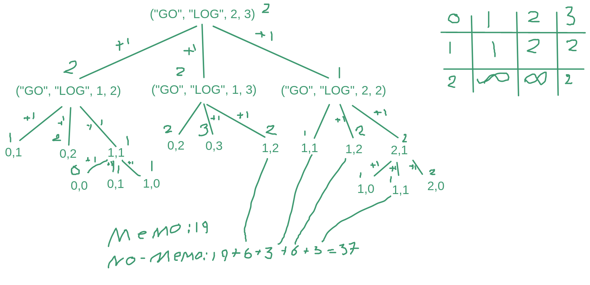

# Exercises
1. Run the edit distance algorithm from the slides on s="GO", t="LOG":
    - What is the edit distance? What edit operations does the algorithm suggest?
    - Draw the recursion tree for a memoized version of the algorithm.
    - Count and compare how many recursive calls are made by the memoized algorithm and how many by a recursive algorithm without memoization.
2. Based on the slides, write a pseudocode for an activity selection problem. First, write an algorithm to just return the maximum number of activities. Then, augment it to print out the selected activities.
3. Solve CLRS 15-2. First, write an algorithm to find the length of the longest palindrome. Then, augment the algorithm to return also the longest palindrome itself.

# Solutions
## Exercise 1


## Exercise 2
## Exercise 3
$
P(i,j) =
\begin{cases}
    0 & i > j \\
    1 & i = j \\
    2 + P(i+1, j-1) & s[i] = s[j] \\
    max(P(i+1,j), P(i,j-1) & otherwise
\end{cases}
$

```
palindrome(str: String): Int = {
    val len = length str
    var memo = replicate len (replicate len 0)

    val _palindrome (i: Int) (j: Int): Int
        | memo[i][j] != 0 = memo[i][j]
        | i > j = 0
        | s[i] == s[j] = {
            memo[i][j] = 2 + _palindrome (i+1) (j-1)
            memo[i][j]
        }
        | otherwise = {
            memo[i][j] = _palindrome (i+1) j `max` _palindrome i (j-1)
            memo[i][j]
        }

    _palindrome 0 (len - 1)
}
```
