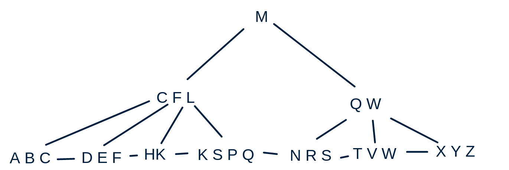

# Exercises
1. Answer the question on slide 39. What if you have all the main memory of your computer?
2. Solve CLRS 18.2-1, but do it for the B+-tree and assuming the minimum number of keys 2 (minimum fan-out 3) and the maximum 4 (maximum fanout 5). The over-full leaf node is split into a left node with 3 entries and a right node with 2 entries.
3. The so-called tree-sort is an asymptotically optimal sorting algorithm in main memory. It works by inserting data elements one-by-one into a balanced binary search tree and then performing an in-order traversal of the tree to print out the elements in the sorted order. Consider data in external memory and answer the following two questions:
    - How to print all the data elements stored in a B+-tree in the sorted order. How is this done in the B-tree?
    - Is the external-memory variant of tree-sort (which uses the B-tree or the B+-tree) an asymptotically optimal sorting algorithm?
4. Solve CLRS 18.2-6.
5. The video in the preparation for today's lecture describes a nested-loop algorithm for removing duplicates from a file in external memory. Answer the question to that video (see Preparation above). Describe also an alternative algorithm using sorting. Assume the original order of the elements (records) has to be preserved. Analyze the worst-case running time (in I/O operations) of both algorithms. Express your running times in terms of n, the number of pages in the file, and m, the number of pages fitting in main memory. Which algorithm would you use, if n = 6000 and m = 1000? (For the sorting-based algorithm, assume that each record is much larger than a single integer, i.e., it can be extended by an integer field without noticeably increasing its size.)
6. Solve CLRS 18-1. Don't be confused about the notation: n and m are defined differently here than in the last part of the lecture about the external merge sort!   For the d part, we have not yet talked about the amortized analysis (we will do that in lecture 6). Instead, think about it this way: you have to make sure that for any sequence/mix of stack operations, the average cost of a single operation is O(1/m) in terms of disk accesses and O(1) in terms of CPU cost.

# Exercise 2

# Exercise 3
B+Tree follow min pointer until leaf is reached then follow linked list.

B-Tree depth first traversal from left to right.

Should be $n$ insertions each taking $log_B(n)$, thus being $\Theta(n \cdot log_B(n))$

# Exercise 4
